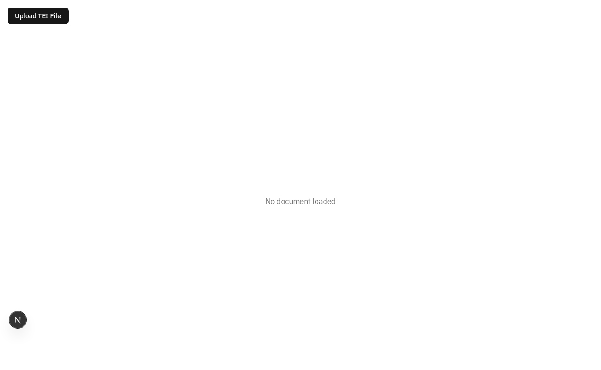

# Deployment Guide

**📖 For feature documentation and user guide, see [FEATURES.md](./FEATURES.md)**

## Environment Setup

### Prerequisites

- Node.js 18+ and npm
- (Optional) Rust and wasm-pack for WASM module compilation

### 1. Install Dependencies

```bash
npm install
```

### 2. Set Up Environment Variables

```bash
cp .env.local.example .env.local
# Edit .env.local with your API keys
```

Required environment variables:

- `OPENAI_API_KEY` - OpenAI API key for Ax dialogue detection (optional but recommended)
- `ANTHROPIC_API_KEY` - Anthropic API key for Ax dialogue detection (alternative to OpenAI)

**Note:** The application will function without API keys using the NLP fallback, but accuracy will be lower.

### 3. Build WASM Module (Optional)

The WASM pattern engine provides enhanced pattern detection but is not required for basic functionality.

```bash
cd pattern-engine
wasm-pack build --target web --out-dir ../public/wasm
```

If you skip this step, the application will use the JavaScript-based pattern engine.

### 4. Run Development Server

```bash
npm run dev
```

The application will be available at `http://localhost:3000`.

### ✅ Verify Your Setup



**You should see:**

- ✅ Welcome page with sample gallery loaded
- ✅ No console errors (check browser DevTools)
- ✅ File upload button is functional
- ✅ Can click on samples to load them

**If you see errors:**

- Check browser console (F12 → Console tab)
- Verify port 3000 is available
- Ensure all dependencies installed (`node_modules` exists)
- See [Troubleshooting](#troubleshooting) below

**Quick Test:**

1. Click on a sample document (e.g., "The Gift of the Magi")
2. Click "Load Sample"
3. Should see the editor with annotated passages
4. Try pressing `Ctrl/Cmd+K` to open command palette

### 5. Run Tests

```bash
# Run all tests
npm test

# Run tests in watch mode
npm test -- --watch

# Run tests with coverage
npm test -- --coverage
```

### 6. Build for Production

```bash
npm run build
```

The optimized production build will be in the `.next` directory.

### 7. Start Production Server

```bash
npm start
```

## Quick Reference: Environment Setup Checklist

Before deploying, verify your setup:

- [ ] **Node.js 18+** installed: `node --version`
- [ ] **Dependencies installed**: `node_modules/` directory exists
- [ ] **Port available**: `lsof -i :3000` shows nothing (or use different port)
- [ ] **Environment file**: `.env.local` created (if using AI features)
- [ ] **WASM built** (optional): `public/wasm/pattern_engine.js` exists
- [ ] **Tests passing**: `npm test` completes successfully
- [ ] **Can load app**: Browser shows welcome screen at `localhost:3000`

## Deployment Options

### Vercel (Recommended)

1. Push your code to GitHub
2. Import project in Vercel
3. Add environment variables in Vercel dashboard
4. Deploy

### Docker

```dockerfile
FROM node:18-alpine
WORKDIR /app
COPY package*.json ./
RUN npm ci --only=production
COPY . .
RUN npm run build
EXPOSE 3000
CMD ["npm", "start"]
```

### Static Export

For static hosting (GitHub Pages, Netlify, etc.):

```bash
# Modify next.config.js to enable static export
npm run build
npm run export
```

## Current Limitations

- **AI Detection Accuracy:** Current F1 score is approximately 11.9%. The system uses a hybrid approach with Ax framework (when API keys are available) and NLP-based detection. Accuracy improves over time as the pattern learning system accumulates user corrections.

- **WASM Module:** The WASM pattern engine requires manual compilation with Rust toolchain. Without it, the JavaScript fallback is used.

- **Pattern Learning:** The pattern learning system requires user interactions (accept/reject suggestions) to build a knowledge base. Initial accuracy will be lower until patterns are learned.

- **Browser Support:** Requires IndexedDB support for pattern storage. Not available in private browsing mode in some browsers.

## Known Issues

See `docs/plans/2026-01-27-critical-issues-fixes.md` for tracking ongoing issues and improvements.

## Troubleshooting

### Setup Verification Checklist

Before diving into specific errors, run through this checklist:

**Environment Check:**

```bash
# Check Node version (must be 18+)
node --version

# Verify npm
npm --version

# Check if port 3000 is available
lsof -i :3000  # Should show nothing or kill the process

# Verify dependencies
ls node_modules | head -10  # Should show packages
```

**Quick Health Check:**

1. Can you run `npm run dev` without errors?
2. Does browser show the welcome screen?
3. Can you load a sample document?
4. Does console show any errors (F12)?

### Common Setup Issues

#### Issue: Module not found errors

**Symptoms:**

```
Error: Cannot find module 'some-package'
```

**Solutions:**

1. Reinstall dependencies:

   ```bash
   rm -rf node_modules package-lock.json
   npm install
   ```

2. Clear npm cache:

   ```bash
   npm cache clean --force
   npm install
   ```

3. Check Node version:
   ```bash
   node --version  # Must be 18+
   ```

#### Issue: Port already in use

**Symptoms:**

```
Error: listen EADDRINUSE: address already in use :::3000
```

**Solutions:**

1. Kill process on port 3000:

   ```bash
   # Find process
   lsof -i :3000

   # Kill it (replace PID with actual process ID)
   kill -9 PID
   ```

2. Or use different port:
   ```bash
   PORT=3001 npm run dev
   ```

#### Issue: WASM module fails to load

**Symptoms:**

- Console errors about `.wasm` files
- Pattern features not working
- Performance issues

**Solutions:**

1. Build WASM module:

   ```bash
   cd pattern-engine
   wasm-pack build --target web --out-dir ../public/wasm
   ```

2. Verify files exist:

   ```bash
   ls public/wasm/
   # Should see: pattern_engine.js, pattern_engine_bg.wasm, etc.
   ```

3. Check Rust toolchain:

   ```bash
   rustc --version
   wasm-pack --version
   ```

4. Or use JavaScript fallback (no action needed)

#### Issue: Cannot find .env.local

**Symptoms:**

- API features not working
- Console shows "API key not provided"

**Solutions:**

1. Create environment file:

   ```bash
   cp .env.local.example .env.local
   ```

2. Edit with your API keys:

   ```bash
   # Edit .env.local and add:
   OPENAI_API_KEY=sk-your-key-here
   # or
   ANTHROPIC_API_KEY=sk-ant-your-key-here
   ```

3. Restart dev server after creating file

### API Key Errors

If you see "API key not provided" errors:

- Ensure `.env.local` exists with valid API keys
- Check that the environment variables are loaded (restart dev server)
- Verify API key format (no extra spaces or quotes)

### WASM Module Errors

If WASM features don't work:

- Ensure `public/wasm/pattern_engine.js` and `.wasm` files exist
- Rebuild WASM module: `cd pattern-engine && wasm-pack build --target web --out-dir ../public/wasm`
- Check browser console for specific error messages

### Database Errors

If pattern storage fails:

- Check that IndexedDB is enabled in your browser
- Ensure you're not in private browsing mode
- Clear browser cache and IndexedDB data
- Check browser console for IndexedDB errors

## Performance Considerations

- **Large Documents:** For TEI documents with 1000+ passages, consider enabling server-side rendering or pagination
- **Memory Usage:** The pattern database grows with usage. Consider implementing periodic cleanup for production deployments
- **API Rate Limits:** When using OpenAI/Anthropic APIs, be aware of rate limits. The system implements automatic fallback to NLP detection.

## Security Considerations

- **API Keys:** Never commit `.env.local` to version control
- **XSS Protection:** All user-generated content is sanitized with DOMPurify
- **Content Security Policy:** Consider adding CSP headers for production deployments
- **Input Validation:** All TEI document inputs are validated before processing

## Monitoring and Logging

The application uses structured logging (`lib/utils/logger.ts`). In production:

- Error logs are sent to console
- Consider integrating error tracking (Sentry, etc.)
- Monitor API usage and costs
- Track pattern learning metrics

## Backup and Recovery

### Pattern Database Backup

```javascript
// Export pattern data
const patterns = await db.getAllLearnedPatterns();
const corrections = await db.getRecentCorrections(10000);

// Save to file
const data = JSON.stringify({ patterns, corrections }, null, 2);
// Download or save to cloud storage
```

### Pattern Database Restore

```javascript
// Load from file
const { patterns, corrections } = JSON.parse(fileContent);

// Restore patterns
for (const pattern of patterns) {
  await db.learnedPatterns.put(pattern);
}

// Restore corrections
for (const correction of corrections) {
  await db.corrections.put(correction);
}
```

## Scaling Considerations

For large-scale deployments:

1. **Server-Side Processing:** Move AI detection to server-side to protect API keys
2. **Database:** Consider migrating from IndexedDB to a server-side database for multi-user support
3. **Caching:** Implement Redis or similar for caching pattern matches
4. **Load Balancing:** Use multiple instances behind a load balancer
5. **CDN:** Deploy static assets to CDN for improved performance

## Support

For issues, questions, or contributions:

- GitHub Issues: [repository-url]
- Documentation: `docs/` directory
- Implementation Plans: `docs/plans/` directory
