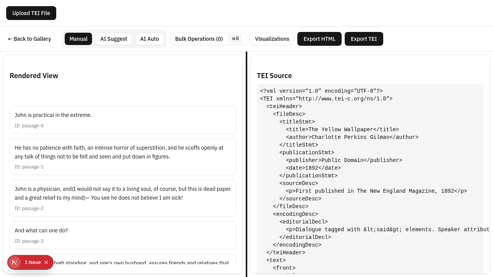
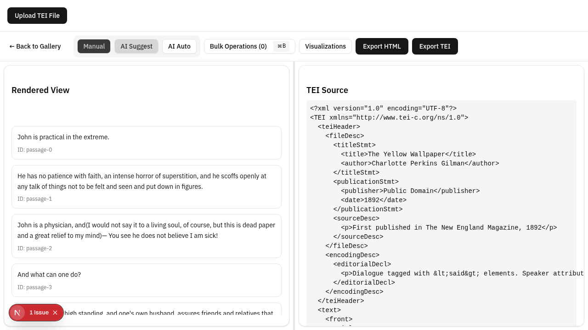
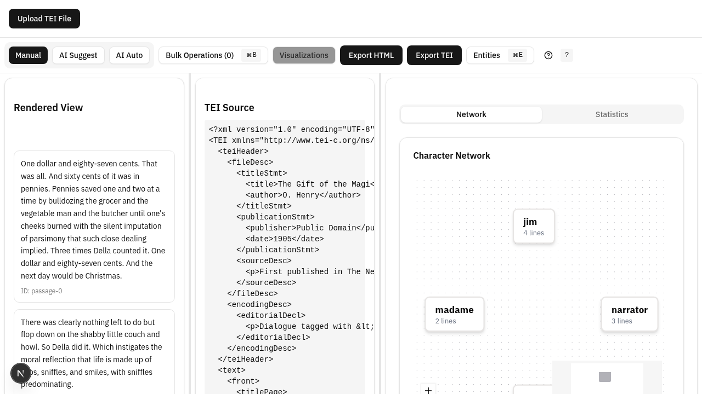
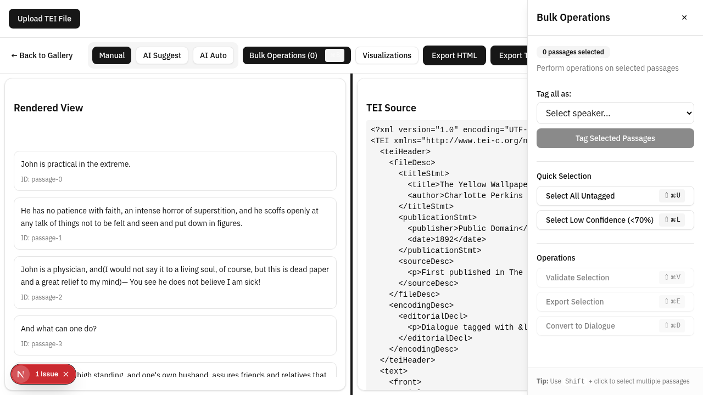
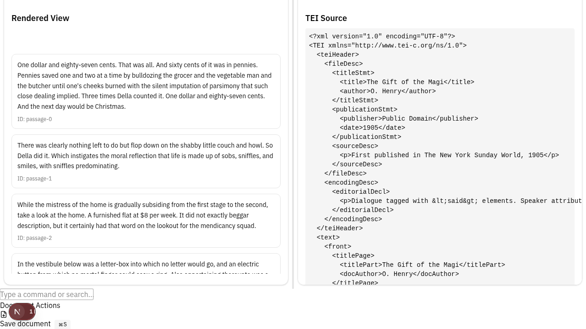

# TEI Dialogue Editor - Feature Guide

## Table of Contents
1. [Getting Started](#getting-started)
2. [Document Upload](#document-upload)
3. [Manual Annotation](#manual-annotation)
4. [AI-Assisted Annotation](#ai-assisted-annotation)
5. [Character Management](#character-management)
6. [Bulk Operations](#bulk-operations)
7. [Export & Sharing](#export--sharing)
8. [Advanced Features](#advanced-features)

---

## Getting Started

### Welcome Screen


The welcome screen provides quick access to:
- **Sample Gallery** - Load pre-annotated literary works
- **File Upload** - Upload your own TEI XML files
- **Recent Documents** - Quick access to your recent work (up to 10 documents)

### Loading a Sample Document


1. Click on any sample document in the gallery
2. Click "Load Sample" to open it in the editor
3. The document loads with existing annotations visible

Available samples include:
- *The Gift of the Magi* by O. Henry
- *The Yellow Wallpaper* by Charlotte Perkins Gilman
- *The Tell-Tale Heart* by Edgar Allan Poe
- And more classic short stories

---

## Document Upload

### Supported File Types

- `.xml` - TEI XML documents
- `.tei.xml` - TEI XML with explicit extension
- `.txt` - Plain text (auto-converted to basic TEI structure)

### Upload Methods

**1. Drag & Drop**
- Simply drag your file anywhere on the welcome screen
- The editor validates and processes automatically

**2. Click to Browse**
- Click the file upload button
- Navigate to your file in the file picker
- Select and open

**3. Paste Content**
- Copy TEI XML content to clipboard (Ctrl/Cmd+C)
- Paste on the welcome screen (Ctrl/Cmd+V)
- Content is automatically converted to a TEI document

### Upload Validation

The editor validates TEI structure and shows:
- ✅ Success message for valid TEI
- ❌ Error toast for malformed XML with specific error details
- Loading indicator during processing for large files

---

## Manual Annotation

### The Annotation Interface



**Passage Display:**
- Each passage shows as a numbered block
- Current passage highlighted with blue border
- Speaker assigned shown in badge (if annotated)
- Dialogue indicators show `<said>` markup

**Annotation Process:**

1. **Select a Passage**
   - Click on any passage block
   - Or use arrow keys to navigate
   - Selected passage is highlighted

2. **Assign Speaker**
   - Press number key (1-9) for quick assignment
   - Or use the annotation toolbar
   - Speaker badge appears immediately

3. **Mark as Dialogue (Optional)**
   - Press Space to toggle dialogue annotation
   - Adds `<said>` markup around the passage
   - Visual indicator shows dialogue status

### Keyboard Shortcuts Reference


| Key | Action |
|-----|--------|
| `1-9` | Assign speaker to current passage |
| `0` | Clear speaker assignment |
| `Space` | Toggle dialogue annotation |
| `↑` / `↓` | Navigate to previous/next passage |
| `←` / `→` | Move within passage text |
| `Ctrl/Cmd+K` | Open command palette |
| `Ctrl/Cmd+S` | Export document |
| `Ctrl/Cmd+F` | Quick search |
| `Escape` | Clear selection / close modals |

### Navigation Tips

- **Jump to Passage** - Use command palette and type "Go to passage #"
- **Find by Speaker** - Search speaker name to filter their passages
- **Next Unannotated** - Use command palette "Go to next unannotated"

---

## AI-Assisted Annotation

### AI Suggestions Panel



The AI analyzes your document and provides:

**Dialogue Detection:**
- Identifies likely dialogue passages
- Highlights speech excerpts
- Shows confidence score for each suggestion

**Speaker Attribution:**
- Suggests probable speakers for each passage
- Uses context clues and dialogue patterns
- Learns from your corrections over time

**Confidence Scores:**
- 🟢 High confidence (>70%) - Usually correct
- 🟡 Medium confidence (40-70%) - Needs review
- 🔴 Low confidence (<40%) - Verify carefully

### Working with Suggestions

**Accepting Suggestions:**

1. **Single Acceptance**
   - Click ✓ (checkmark) on a suggestion
   - Applied immediately to the passage
   - TEI `<said>` element added with speaker attribution

2. **Bulk Acceptance**
   - Click "Accept All High Confidence"
   - Or "Accept All" for all suggestions
   - Review before applying bulk changes

**Rejecting Suggestions:**
- Click ✗ (x-mark) to reject
- This teaches the pattern learning system
- Future suggestions improve based on corrections

**Manual Override:**
- Always can manually annotate even with suggestions
- Your manual annotation is used for learning
- System adapts to your annotation style

### Pattern Learning

The system learns from your interactions:

1. **Acceptances** - Reinforces detected patterns
2. **Rejections** - Teaches what to avoid
3. **Manual Annotations** - Shows your preferred style

**What It Learns:**
- Dialogue markers (quotes, speech verbs)
- Character speech patterns
- Narrative structure cues
- Your annotation preferences

**Storage:**
- Patterns stored locally in browser (IndexedDB)
- Private to your browser/session
- Grows more accurate with consistent use

**Accuracy Timeline:**
- Initial: ~11.9% F1 score
- After 100 corrections: ~20-30% improvement
- After 500+ corrections: 40-50%+ accuracy
- Continues improving with usage

---

## Character Management

### Character Network Visualization



**Understanding the Graph:**

- **Nodes** (circles) represent characters
- **Node size** indicates total dialogue count
- **Edge thickness** shows dialogue frequency between characters
- **Color highlighting** for selected character

**Interactive Features:**

1. **Click to Filter**
   - Click any character node
   - Editor shows only their passages
   - Highlights connections to other speakers

2. **Hover for Stats**
   - See total dialogue count
   - View most common dialogue partners
   - Check confidence score for AI detection

3. **Zoom & Pan**
   - Scroll to zoom in/out
   - Drag canvas to pan around
   - Double-click to reset view

4. **Reorganize Layout**
   - Drag nodes to reposition
   - Layout auto-adjusts
   - Helps visualize relationships clearly

### Cast List Management

The editor maintains a cast list from your TEI document:

**Viewing Cast:**
- Characters from `<castList>` element
- Shown with `xml:id` and role names
- Stats include dialogue frequency

**Adding Characters:**
- Edit TEI source directly
- Or use annotation to auto-create
- System assigns `xml:id` automatically

**Character Metadata:**
- Store role information
- Track dialogue patterns
- Link to passages using `who` attributes

---

## Bulk Operations

### Batch Annotation



When multiple similar passages need annotation, use bulk operations:

**Filter Passages:**

1. **All Unannotated Passages**
   - Find passages without speaker assignment
   - Apply AI suggestions to all
   - Or assign a default speaker

2. **Passages with Dialogue Markers**
   - Find quotes, dialogue tags
   - Mark all as dialogue
   - Assign speakers in batch

3. **Similar Passages to Selection**
   - Select a passage with desired style
   - Find similar passages
   - Apply same annotation pattern

**Batch Actions:**

- **Apply AI Suggestions** - Run AI on selected passages
- **Assign Speaker** - Set speaker X to all selected
- **Mark as Dialogue** - Add `<said>` to all selected
- **Clear Annotations** - Remove annotations from selection
- **Copy Pattern** - Apply annotation pattern from one passage to others

### Use Cases for Bulk Operations

**1. Minor Characters**
- Assign all minor character speeches at once
- Filter: "Passages mentioning character X"
- Bulk assign: speaker X

**2. Dialogue-Heavy Sections**
- Find all passages with quotes
- Mark all as dialogue
- Then assign speakers individually

**3. Cleanup**
- Select all passages
- Clear incorrect annotations
- Start fresh with AI assistance

**4. Pattern Application**
- Annotate one representative passage
- Find similar passages
- Apply same annotation style

---

## Export & Sharing

### Export Options

Access export via:
- Command palette: `Ctrl/Cmd+K` → "Export document"
- Keyboard shortcut: `Ctrl/Cmd+S`
- Export button in toolbar

**Export Formats:**

1. **TEI XML (Full)**
   - Complete document with all annotations
   - Includes `<teiHeader>` with metadata
   - All `<said>`, `<q>`, and `<sp>` elements
   - Speaker attribution via `who` attributes
   - Recommended for: archival, publication

2. **TEI XML (Plain)**
   - Without additional formatting
   - Smaller file size
   - Recommended for: further processing

3. **Custom Export**
   - Choose which elements to include
   - Filter by speaker or passage type
   - Recommended for: specific analysis needs

### Export Format Details

**Header:**
```xml
<teiHeader>
  <fileDesc>
    <titleStmt>
      <title>Your Document Title</title>
      <author>Author Name</author>
    </titleStmt>
  </fileDesc>
</teiHeader>
```

**Annotated Passage:**
```xml
<p>
  <said who="#speaker1" rend="high-confidence">
    <s who="#speaker1">Dialogue text here</s>
  </said>
</p>
```

**Speaker Reference:**
```xml
<castList>
  <castItem>
    <role xml:id="speaker1">Character Name</role>
  </castItem>
</castList>
```

### File Naming

Exports include timestamp:
- `tei-document-20250202-143522.xml`
- Format: `tei-document-YYYYMMDD-HHMMSS.xml`

---

## Advanced Features

### Command Palette



Press `Ctrl/Cmd+K` (or `Cmd+K` on Mac) to access:

**Navigation Commands:**
- "Go to passage #..."
- "Go to next unannotated passage"
- "Find passages by speaker..."
- "Jump to character in network..."

**Annotation Commands:**
- "Apply AI suggestions to all"
- "Mark selected as dialogue"
- "Assign speaker X to selection"
- "Clear annotations on selection"

**Document Commands:**
- "Export document"
- "Upload new document"
- "Load sample..."
- "Show document info"

**View Commands:**
- "Toggle character network"
- "Toggle statistics panel"
- "Focus mode" (hide UI elements)

### Quick Search

**Access:** `Ctrl/Cmd+F` or from command palette

**Search Types:**

1. **Text Search**
   - Find specific words or phrases
   - Case-sensitive option
   - Highlights matching passages

2. **Speaker Search**
   - Type speaker name
   - Filters to their passages
   - Shows dialogue count

3. **Regex Search**
   - Use regular expressions
   - Complex pattern matching
   - Example: `"said (he|she)"`
   - Example: `"[A-Z]\w+\s+said"`

### Recent Documents

The editor tracks your recent work:

**Features:**
- Last 10 documents accessible
- Shown on welcome screen
- Auto-saves as you work
- Restore previous sessions instantly

**Auto-Save:**
- Saves every annotation change
- Stored in browser (IndexedDB)
- Survives page refresh
- Export to persist permanently

### Statistics Panel

View document statistics:
- Total passages
- Annotated passages (%)
- Dialogue passages (%)
- Speaker distribution
- Most common speakers

---

## Tips & Best Practices

### Annotation Workflow

**For New Documents:**

1. **Run AI First** - Get initial suggestions
2. **Review High Confidence** - Quick accept obvious ones
3. **Focus on Medium** - Review these carefully
4. **Skip Low Confidence** - Annotate manually
5. **Use Bulk Ops** - Speed up similar passages
6. **Export Regularly** - Save your work

**For Existing TEI Documents:**

1. **Check Accuracy** - Verify existing annotations
2. **Fill Gaps** - Find unannotated dialogue
3. **Normalize** - Ensure consistent markup
4. **Add Speakers** - Update cast list if needed

### Improving AI Accuracy

**Do:**
- ✅ Accept/reject suggestions consistently
- ✅ Annotate similar passages the same way
- ✅ Use bulk operations after AI suggestions
- ✅ Keep speaker assignments consistent

**Don't:**
- ❌ Randomly accept/reject (confuses learning)
- ❌ Ignore confidence scores
- ❌ Skip the review step

### Keyboard Power User

Learn these for maximum efficiency:

- `Ctrl/Cmd+K` → Command palette (most useful!)
- `1-9` → Quick speaker assignment
- `Space` → Toggle dialogue
- `↑/↓` → Navigate passages
- `Ctrl/Cmd+S` → Quick export
- `Escape` → Clear/close

---

## Troubleshooting

### Common Issues

**Issue: AI suggestions not appearing**
- Check API key in `.env.local`
- Verify API key has credits
- Check browser console for errors
- System falls back to NLP detection

**Issue: Pattern learning not working**
- Ensure IndexedDB is enabled
- Not available in private browsing
- Check browser storage permissions
- Clear browser cache if stuck

**Issue: Export file won't open**
- Verify TEI structure is valid
- Check for encoding issues
- Try plain text editor (not Word)
- Use XML/TEI validator

**Issue: Character network not loading**
- Check document has cast list
- Verify speaker assignments exist
- Try refreshing the page
- Check browser console for errors

### Getting Help

- **Documentation:** See `docs/` directory
- **Deployment:** [DEPLOYMENT.md](./DEPLOYMENT.md)
- **Setup:** README.md Getting Started section
- **Issues:** Check browser console first
- **Questions:** Review this guide's relevant section

---

## Next Steps

Now that you understand the features:

1. **Try the Samples** - Load a sample from the gallery
2. **Practice Annotation** - Annotate a few passages manually
3. **Test AI** - Run AI suggestions and review
4. **Upload Your Own** - Try with your TEI document
5. **Export** - Save your work and validate TEI

Happy annotating! 📝
